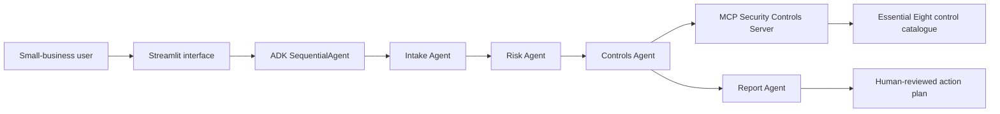

# CyberGuard AI
## A safe cybersecurity triage assistant for small organisations

**Kaggle AI Agents: Intensive Vibe Coding Capstone — Agents for Good**

CyberGuard AI helps a small organisation turn a confusing cyber concern into a
structured, human-reviewed action plan. It is designed for defensive awareness
and triage only: it does not scan systems, execute commands, exploit weaknesses,
collect credentials, or replace a qualified security professional.

## The problem

Small organisations often have no dedicated security team. When a suspicious
email, lost device, weak password practice, or possible account compromise occurs,
staff may not know what to do first. Delays and unstructured responses can increase
harm.

## The solution

CyberGuard AI uses a focused multi-agent workflow:

1. **Intake Agent** converts a plain-language concern into a minimal incident brief.
2. **Risk Agent** estimates likelihood, impact, and priority using a transparent
   5 × 5 risk matrix.
3. **Controls Agent** retrieves relevant defensive controls from a local MCP server.
4. **Report Agent** produces a safe, ordered action plan that requires human review.

## Architecture



## Capstone concepts demonstrated

| Requirement | Where it appears |
|---|---|
| ADK multi-agent system | `cyberguard_agent/agent.py` uses a `SequentialAgent` and four specialised agents. |
| MCP server | `mcp_server/server.py` exposes control guidance and the risk matrix through FastMCP. |
| Security features | Input minimisation, redaction, least-privilege local tools, no destructive operations, and API keys stored only in `.env`. |
| Deployability | Streamlit app plus `Dockerfile`. |
| Agent skills | Custom Python risk calculation tool and MCP-served control lookup. |
| Antigravity | Demonstrated in the project video while building/testing the application. |

## Repository structure

```text
cyberguard-ai/
├── app.py                         # Safe local demo UI
├── cyberguard_agent/
│   ├── agent.py                   # ADK multi-agent workflow
│   └── tools/
│       ├── controls.py            # Local catalogue used by demo
│       ├── redaction.py           # Basic secret/PII minimisation
│       └── risk.py                # Transparent risk calculation
├── mcp_server/
│   └── server.py                  # FastMCP server for agent tools
├── tests/
│   └── test_risk.py
├── Dockerfile
├── requirements.txt
└── .env.example
```

## Safety and privacy design

- **Defensive-only:** no port scans, exploitation, phishing generation, credential
  collection, malware analysis, or system changes.
- **Human review:** reports explicitly state that a responsible person must approve
  actions before implementation.
- **Data minimisation:** users are told not to enter passwords, API keys, recovery
  codes, full personal details, or confidential files.
- **Input redaction:** common secrets and email-like identifiers are redacted before
  the text is shown in the local demo.
- **Least privilege:** the MCP server exposes only a static control catalogue and a
  mathematical risk calculator. It cannot access files, networks, or operating
  system commands.
- **No secrets in Git:** `.env` is excluded via `.gitignore`; use `.env.example` as
  a template.

## Run the safe local demo

### 1. Install prerequisites

- Python 3.10 or newer
- A Gemini API key only when running the ADK agent workflow

### 2. Create and activate a virtual environment

**macOS / Linux**

```bash
python3 -m venv .venv
source .venv/bin/activate
```

**Windows PowerShell**

```powershell
python -m venv .venv
.\.venv\Scripts\Activate.ps1
```

### 3. Install dependencies

```bash
pip install -r requirements.txt
```

### 4. Start the local demo interface

```bash
streamlit run app.py
```

This local demo works without an API key. It shows the same transparent risk matrix
and defensive controls that the agent workflow uses.

## Run the ADK multi-agent workflow

1. Copy `.env.example` to `.env`.
2. Add your own `GOOGLE_API_KEY` locally. Never commit this file.
3. Start the ADK development interface from the repository root:

```bash
adk web
```

4. In the ADK interface, select `cyberguard_agent`.
5. Try this safe prompt:

> A staff member clicked a suspicious link in an email but did not enter a password. They use a shared laptop and are unsure what to do.

The workflow will produce an intake brief, a risk score, relevant controls retrieved
through the MCP server, and a human-review action plan.

## Run and inspect the MCP server

The security-controls server is deliberately local and read-only.

```bash
python mcp_server/server.py
```

To inspect MCP tools during the video demonstration:

```bash
npx @modelcontextprotocol/inspector python mcp_server/server.py
```

## Test

```bash
pytest -q
```

## Docker

```bash
docker build -t cyberguard-ai .
docker run --rm -p 8501:8501 cyberguard-ai
```

Open `http://localhost:8501`.

## Suggested 5-minute video flow

1. **0:00–0:35:** Explain the small-business cyber-triage problem.
2. **0:35–1:10:** Explain why a structured agent team is safer than one generic chatbot.
3. **1:10–1:55:** Show the architecture diagram and the four agents.
4. **1:55–3:10:** Run the Streamlit demo with the suspicious-email example.
5. **3:10–4:00:** Show the MCP Inspector and its two safe tools.
6. **4:00–4:35:** Show the ADK Dev UI agent graph / workflow.
7. **4:35–5:00:** Explain privacy controls, human review, and future work.

## Limitations

- This is an educational triage tool, not an incident-response service.
- The risk score is an aid to prioritisation, not a formal risk assessment.
- The control catalogue is intentionally short for transparency. Production use should
  involve a security professional and an organisation-approved control framework.

## Future improvements

- User-approved integration with a ticketing system.
- Organisation-specific policies through an authenticated MCP server.
- Evaluation datasets for consistent risk scoring.
- Optional accessibility and multilingual support.
